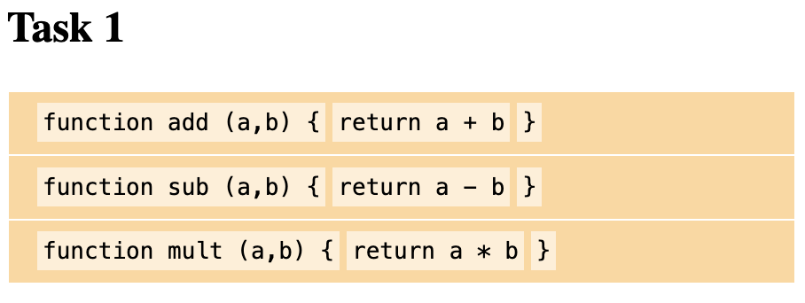
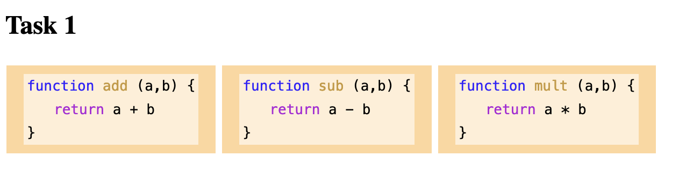
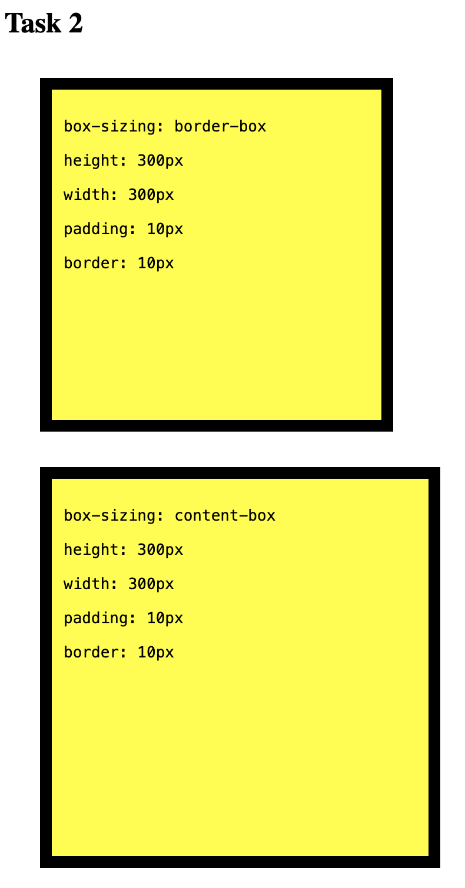
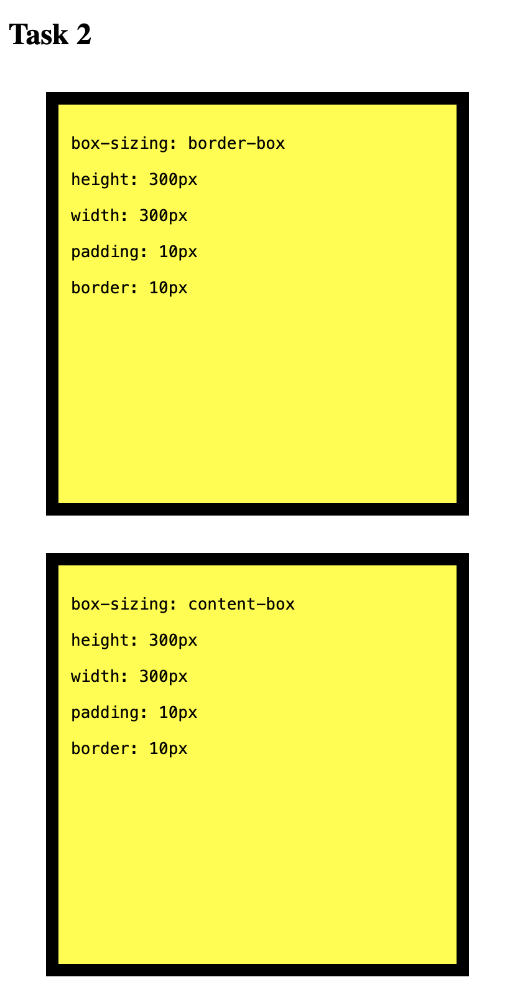

# box-model

On a webpage everything is a box. Whether it's a `
`, `<ul>`, `
`, `` or anything else it will be positioned and rendered in a rectangle.

The shape size, and exact positioning of an element will depend on various attributes including:

- `display`
- `padding`
- `margin`
- `border`
- `box-sizing`
- and more...

## Tasks

### Inline Vs. Block

1.  Style the `<code>` elements so each appears as a `block` and not `inline` like they are currently.
2.  Add `` tags to the `html` to allow you change the colours to match the wireframe below (or your own VSCode theme!)
3.  Style the `<section>` tags so that they appear side-by-side!

> before...

> after...

### Box sizing

change the `height` and `width` properties of the `border` box to make it the same size as

> before...

> after...

