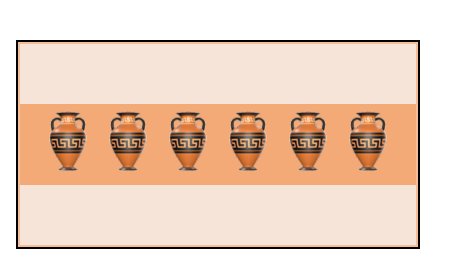
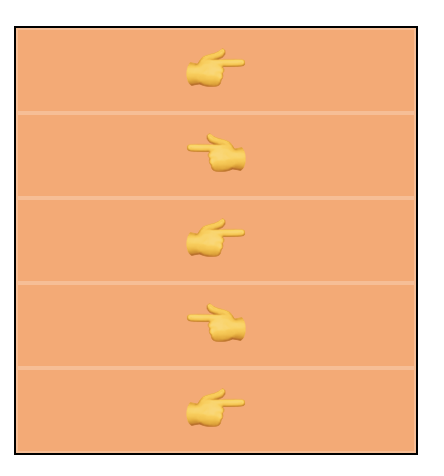
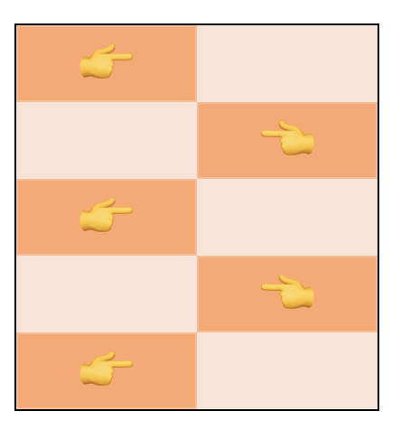

# padding-margin

- more differences between

- flexible?

## Tasks

### 1. Default margin/padding

Even though there is no padding or margin applied in the css file there's a gap around the emojis... those vases are expensive and will break

Use your web browsers developer tools to inspect the elements and find which element type has some _default_ margin/padding applied. Style the element to remove the gap.

> before...

> after...

### 2. `margin`

Using `margin` create the following pattern.

You can use absolute or relative units here

> before...

> after...

- resize just using one/both

- create boxes with backgrounds/borders - these should be visible (so use margin, for example)

- top/right/bottom/left only

  - TRBL
  - add some padding to the sides of the text

- `margin: auto`

- parent div with two children - add margin

- remove default padding & margin from \
 and \<ul> etc
  - investigate what is causing the offset
