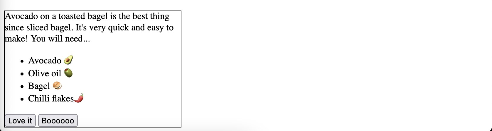
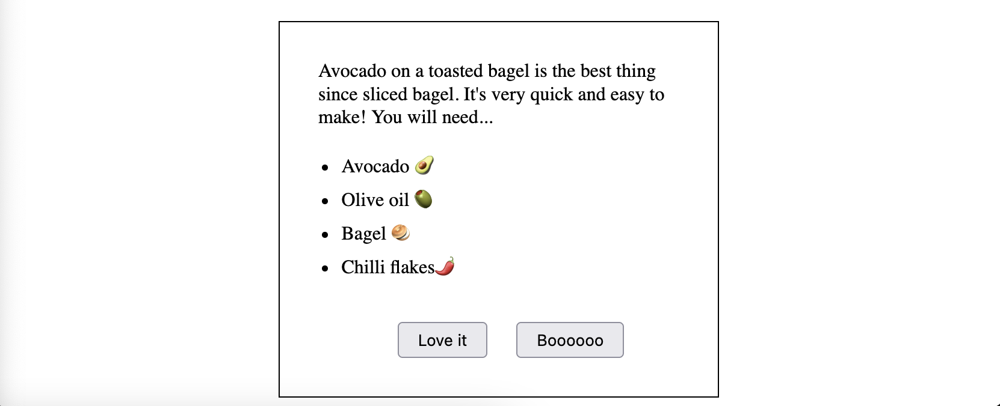

# padding-margin

## Tasks

### 1. Default margin/padding

Even though there is no padding or margin applied in the css file there's a gap around the emojis... those vases are expensive and will break

Use your web browsers developer tools to inspect the elements and find which element type has some _default_ margin/padding applied. Style the element to remove the gap.

> before...

> after...

---

### 2. `margin`

Using `margin` create the following pattern.

You can use absolute or relative units here

> before...

> after...

---

### 3. Frogger

Create a straight path from the frog `🐸 `to the bed `🛏️ `!

_Avoid_ the cars and _cross over_ the turtles and logs!

Rules:

- Only use `padding` on the cars
- Only use `margin` on the logs and 'turtles'

---

### 4. Find your centre

Breathe in... and breathe out... 🧘

Help the spa-goer find their centre using `margin`.

They must remain centred even as the window is resized!

---

### 5. Style the article

We have an article which has all the content it needs but everything has it's default margins and padding and it looks very cramped!

Using `padding` and `margin` _only_

- Add some whitespace
- Line up the bullet points with the article text
- Centre the buttons, add some space between them and make them a little bigger!

> before...

> after...

<!--
- resize just using one/both

- create boxes with backgrounds/borders - these should be visible (so use margin, for example)

- top/right/bottom/left only

  - TRBL
  - add some padding to the sides of the text

- `margin: auto`

- parent div with two children - add margin

- remove default padding & margin from \
 and \<ul> etc
  - investigate what is causing the offset -->
