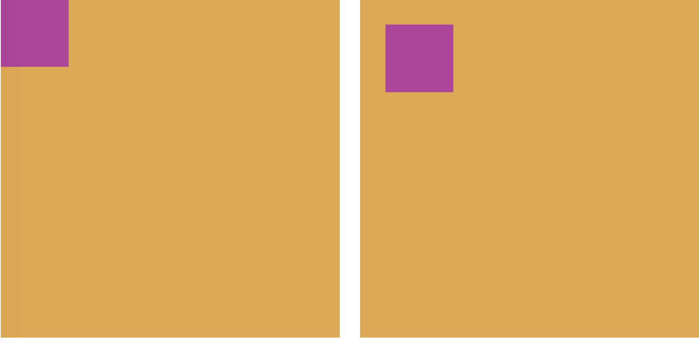

# Position

Positioning is one of the most poweful tools available to us in CSS and when you come to designing website and mobile apps, it is something that will become part of your every day arsenal of creative tools.

In this kata, we are going to look at three types of positioning(but there are more for you to look up in your own time :P!)

### Relative:

We use **position:relative** when we want to position something relative to it's normal position. So **'right: 10px'** will add add 10p to the elements RIGHT position.

```css
.box {
  position: relative;
}
```

---

### Absolute:

We use **position:absolute** when we want to position something relative to it's parent element. If no parent element has an attribute of **position:relative**, then by default the element will absolutely position itself to '0, 0'(**top left**) of the **BODY** element in the HTML!

```html
<div class="parent">
  <div class="child"></div>
</div>
```

```css
.parent {
  width: 400px;
  height: 400px;
  position: relative;
}

.child {
  width: 100px;
  height: 100px;
  position: absolute;
  top: 30px;
  left: 30px;
}
```



In the example above, the left image will be the default positioning of the **child** element when seeting it's position to **absolute**. The square on the right is the outcome of setting it's top and left positioning attributes to 30px.

---

### Fixed:

```css
.box {
  position: fixed;
}
```

We use **position:fixed** when we want to position an element relative to the browser window. One of the most common uses of this styling is to fix the header of your website to the top of the page and still allow your page to have scriolling functionality.

- Once you have completed all your tasks, there is some code that you can uncomment to see **position:fixed** in action!
- lines **27 - 29** & **44 - 47** in the position.css! Make sure you complete all of the following tasks/games first!

---

## TASKS:

### Game 1:

- as you can see we have enetered Northcoders very own retro games arcade!
- your task is simple, re-arrange the squares using the **right, left, top and bottom** position properties only so that they are positioned in the correct corner!

### Game 2:

- It's time to rearrange some circles! Using the **top** position property in the circles style elements only, align both circles and the middle beam correctly!

> NB It may be tempting to just copy the other values, but try and increment the **top** position property to get a feel for how far the circles move, depending on the value you enter!

### Game 3:

- Finally! You have to help player one escape! Using the **top** and **left** position properties, guide player one through the obstacle course to safety at the end!

Now you have done all the tasks! Scroll the page and THEN uncomment the aforemention code and try scrolling again!
